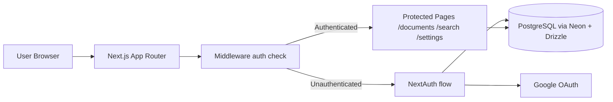
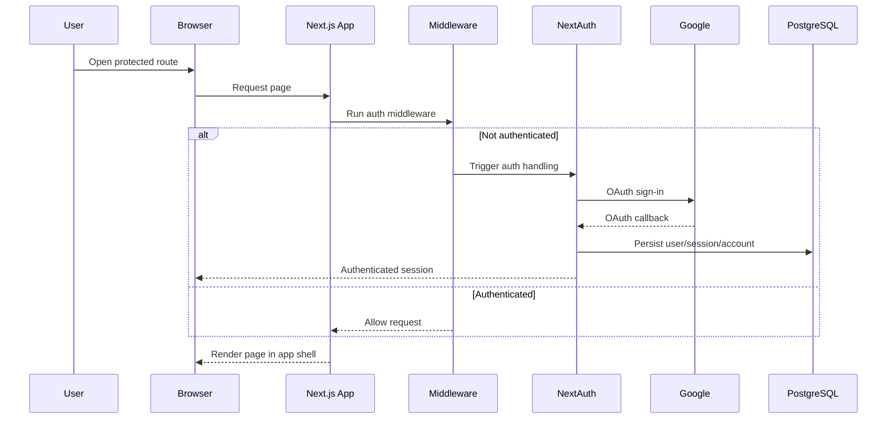

# Docusift

Docusift is a Next.js web application intended to help users organize and extract value from their documents.  
The current implementation provides an authenticated application shell (Google sign-in, protected routes, sidebar navigation) and foundational data/auth infrastructure using NextAuth + Drizzle + Neon/PostgreSQL.

## Features

- Google authentication via NextAuth
- Route protection using middleware (`src/middleware.ts`)
- Sidebar-based app navigation for:
  - Documents (`/documents`)
  - Search (`/search`)
  - Settings (`/settings`)
- Database-backed auth models (users, sessions, accounts, verification tokens, authenticators) with Drizzle ORM
- Next.js App Router project structure with server actions for sign-in/sign-out

## Technology Stack

- **Framework:** Next.js 15 (App Router)
- **Language:** TypeScript
- **UI:** React 19, Tailwind CSS 4, shadcn/ui + Radix UI primitives, lucide-react icons
- **Authentication:** NextAuth v5 (beta) with Google provider
- **Database/ORM:** PostgreSQL (Neon serverless driver) + Drizzle ORM + Drizzle Kit
- **Tooling:** ESLint (via `next lint`), Biome config present

## Prerequisites

- Node.js (LTS recommended)
- npm
- PostgreSQL-compatible database URL (for example Neon)
- Google OAuth credentials for NextAuth

## Installation & Setup

1. Clone the repository and move into it.
2. Install dependencies:

   ```bash
   npm install
   ```

3. Create `.env` from `.env.example` and fill values:

   ```bash
   cp .env.example .env
   ```

4. Start development server:

   ```bash
   npm run dev
   ```

5. Open `http://localhost:3000`.

## Environment Variables

Defined in `.env.example`:

- `DATABASE_URL` - PostgreSQL connection string used by Drizzle/Neon
- `AUTH_SECRET` - NextAuth secret
- `AUTH_GOOGLE_ID` - Google OAuth client ID
- `AUTH_GOOGLE_SECRET` - Google OAuth client secret

## Scripts

From `package.json`:

- `npm run dev` - start Next.js dev server (`next dev --turbopack`)
- `npm run build` - production build
- `npm run start` - run production server
- `npm run lint` - run Next.js lint checks

## Repository Structure

```text
docusift/
├── drizzle/                     # Drizzle metadata output
├── public/                      # Static assets
├── src/
│   ├── app/
│   │   ├── api/auth/[...nextauth]/route.ts   # NextAuth API route handlers (GET/POST)
│   │   ├── documents/page.tsx                 # Documents page (current placeholder)
│   │   ├── search/page.tsx                    # Search page (current placeholder)
│   │   ├── settings/page.tsx                  # Settings page (current placeholder)
│   │   ├── globals.css                        # Global styles / Tailwind theme tokens
│   │   ├── layout.tsx                         # Root layout with app sidebar + content shell
│   │   └── page.tsx                           # Home page (currently sign-out action)
│   ├── components/
│   │   ├── app-sidebar.tsx                    # Main navigation sidebar
│   │   ├── sign-in.tsx                        # Server action Google sign-in form
│   │   ├── sign-out.tsx                       # Server action sign-out form
│   │   └── ui/                                # Reusable UI primitives
│   ├── db/
│   │   ├── drizzle.ts                         # Drizzle client initialization
│   │   └── schema.ts                          # Auth-related table definitions
│   ├── auth.ts                                # NextAuth configuration and exports
│   └── middleware.ts                          # Route protection middleware
├── drizzle.config.ts            # Drizzle Kit config
├── package.json                 # Scripts and dependencies
└── .env.example                 # Required environment variables
```

## Architecture



## User / Request Flow



## API / Routes

This project currently has **one implemented API route** for authentication:

- `GET /api/auth/[...nextauth]`
- `POST /api/auth/[...nextauth]`

These handlers are exported from `src/app/api/auth/[...nextauth]/route.ts` via `handlers` from `src/auth.ts`.

There are **no custom business backend API endpoints** in the current repository beyond NextAuth’s auth route.

## Deployment Guidance

This is a standard Next.js application and can be deployed on platforms that support Node.js (for example Vercel).

Before deployment:

1. Set all required environment variables from `.env.example`.
2. Ensure the production database is reachable via `DATABASE_URL`.
3. Configure Google OAuth callback URLs for your deployment domain.
4. Build and run:

   ```bash
   npm run build
   npm run start
   ```

## Contribution

Contributions are welcome through pull requests. Keep changes focused and aligned with the existing stack and project direction.
